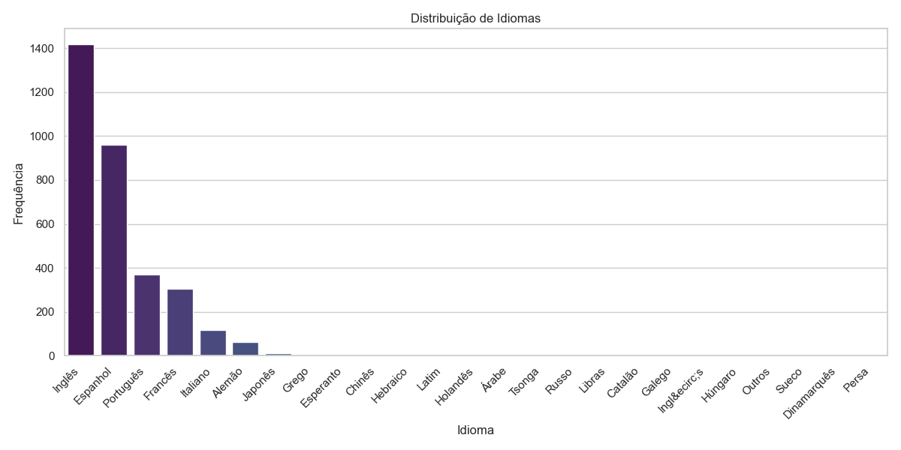
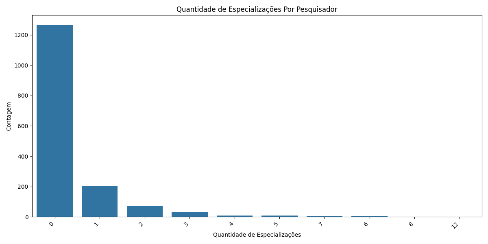
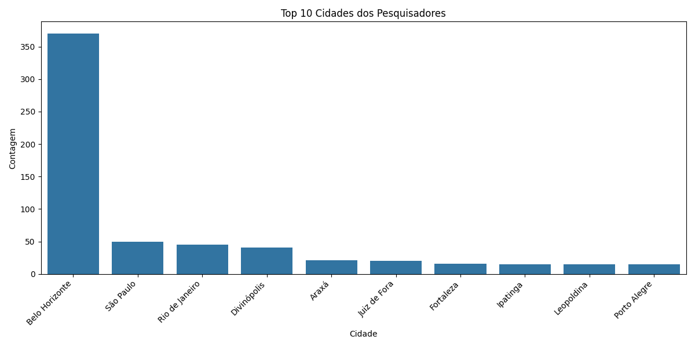
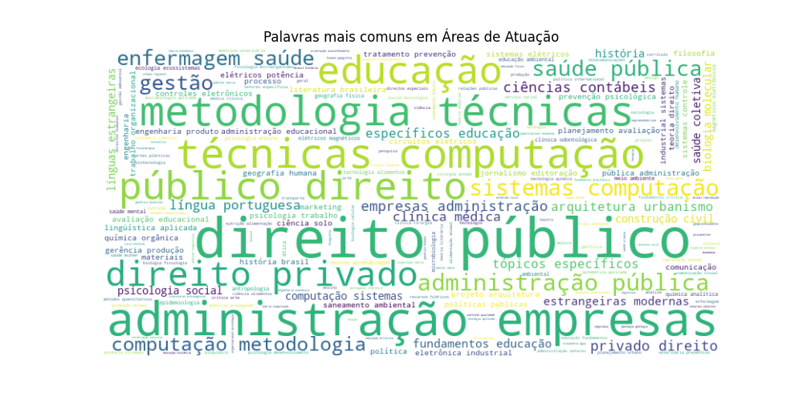
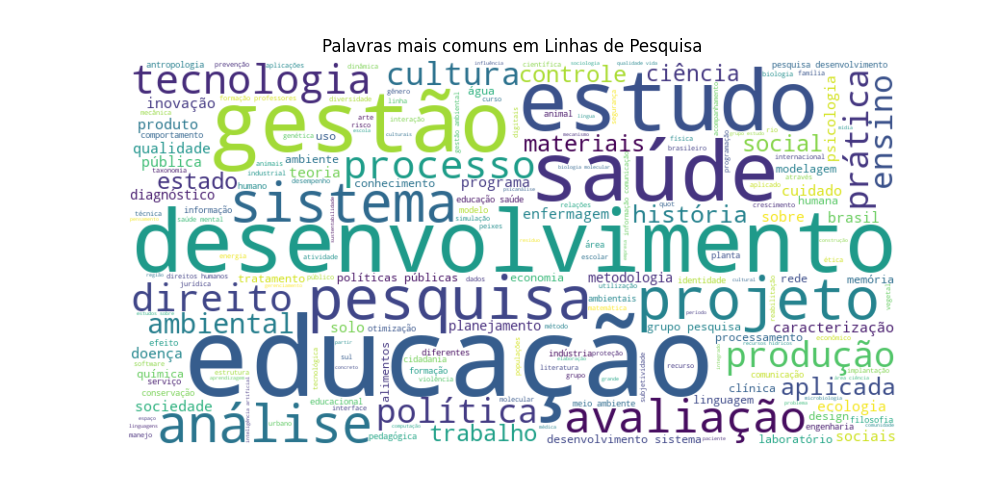

# Lattes CV Extractor

## Descrição

O Lattes CV Extractor é um script em Python que extrai informações de currículos Lattes armazenados em arquivos XML e as armazena em um arquivo CSV. Ele é capaz de extrair informações como nome completo, cidade de nascimento, nome em citações bibliográficas, endereço profissional, telefone profissional, além de dados sobre graduação, curso técnico, especialização, mestrado e doutorado.

Este projeto foi desenvolvido para extrair dados de currículos de professores do CEFET e analisá-los usando a biblioteca Pandas para criação de dados e estudos.

## Como usar

Para utilizar o Lattes CV Extractor, siga as etapas abaixo:

1. Clone o repositório ou faça o download do código fonte.
2. Certifique-se de ter o Python 3 instalado em seu computador.
3. Abra o terminal ou prompt de comando e navegue até a pasta onde o código fonte está localizado.
4. Execute o script com o comando `python <nomedoarquivo>.py`, substituindo `<nomedoarquivo>` pelo nome do arquivo do script.
5. O script irá extrair as informações dos arquivos XML contidos em arquivos ZIP na pasta especificada no código e armazená-las em um arquivo CSV.

## Contribuindo

Contribuições são sempre bem-vindas! Se você tiver alguma sugestão ou correção, sinta-se à vontade para abrir uma issue ou enviar um pull request.

## Gráficos

**Gráfico de idiomas**

Este gráfico mostra a distribuição de idiomas falados pelos pesquisadores.

**Gráfico de quantidade de especializações**

Este gráfico mostra a quantidade de especializações realizadas pelos pesquisadores.

**Gráfico de top cidades de pesquisadores**

Este gráfico mostra as cidades com mais pesquisadores.

**Gráfico de wordcloud de áreas de atuação**

Este gráfico mostra as áreas de atuação dos pesquisadores.

**Gráfico de wordcloud de linhas de pesquisa**

Este gráfico mostra as linhas de pesquisa dos pesquisadores.

## Contribuindo

Contribuições são sempre bem-vindas! Se você tiver alguma sugestão ou correção, sinta-se à vontade para abrir uma issue ou enviar um pull request.
